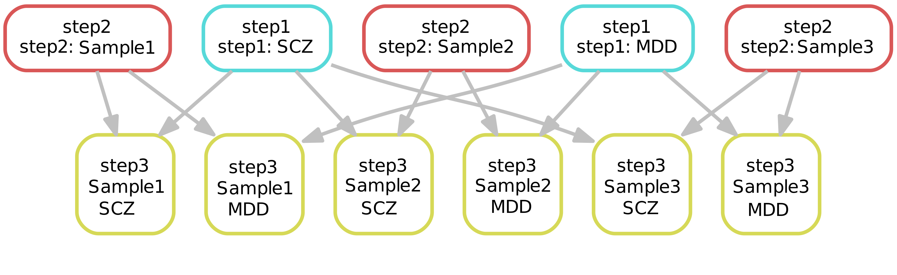
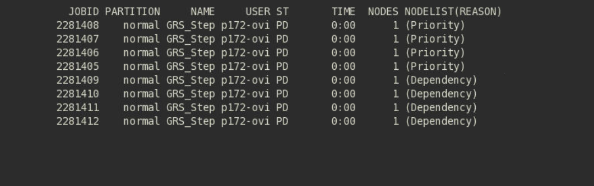

# GRSworkflow for use case 1.1
This workflow is developed by [Dr. Yi Lu](mailto:lu.yi@ki.se) and [Oskar Vidarsson](mailto:oskar.vidarsson@uib.no). Please contact us with any questions.

Conceptual representation of the workflow that assumes two input files for step 1 and three input files for step 2. The third step is a nested loop that combines the output from the first file from step 1 with each output from step 2, and this is repeated for each output file from step 1 as shown in the image.

## Instructions for setting up and testing the workflow without slurm  
Steps:  
1. Clone this repository `git clone -b optimized-cleaned https://github.com/neicnordic/GRSworkflow.git`  
2. Run `./singularity/BuildSingularity.sh` to build the singularity image  
3. Download the "Testdata.tar.gz" archive from https://ki.box.com/s/ct9pibmwu38z0jgfqvtyqr4et07niyad  
4. Untar the Testdata.tar.gz with `tar -zxvf Testdata.tar.gz`, put the `data` directory in the `GRSworkflow` directory and the `s1` and `s2` directories from the `testdata` directory in `data/geno/raw`.  
5. Run `./scripts/dl-references.sh`  
6. Run `./scripts/start-bash-pipeline.sh` to test the pipeline  

TSD specific tip

On TSD you can easily set the workflow up with the `copy-workflow.sh` script. It lets you copy the workflow from the shared disk to a directory of your choice, and it also automatically sets up test data so you can verify that the workflow runs before you use actual production data.

Simply run `/tsd/shared/bioinformatics/workflows/GRSworkflow/scripts/copy-workflow.sh -d /path/to/where/you/want/to/place/the/workflow -t` to both copy the workflow directory as well as automatically put toy data and references in place. The `-t` flag is optional and does not require any arguments.

## Step by step instructions to adapt the parallelized workflow to your slurm setup  
1. Follow step 1 to 5 above  
2. Copy the `scripts/RunTsdSbatchPipeline.sh` script to `scripts/RunNAMESbatchPipeline.sh` and change NAME to the name of your platform.  
3. Proceed by opening the `settings/settings.conf` file with a text editor.  
4. Begin by changing the account name in the `ACCOUNT` variable to your own account name  
5. Edit the `S1MEMPERCPU`, `S2MEMPERCPU` and `S3MEMPERCPU` variables to however many MB, including margin, each step needs. The defaults work fine with the test files.  
6. Edit the `S1TIME`, `S2TIME` and `S3TIME` variables to however much time, including margin, each step needs. The defaults work fine for testing.  
7. Edit or remove the `source /cluster/bin/jobsetup` line as well as the two `module` lines if necessary.  
8. Now open the `scripts/step1.sbatch` file and go the `singularity exec ...` command and edit the mount points (i.e the -B and --home flags) so that they are correct for your specific system. The mount points from the original script only work for TSD, it's possible you don't need the --home flag at all.  
9. Repeat step 7 and 8 for `scripts/step2.sbatch` and `scripts/step3.sbatch`.  
10. You are now ready to test the pipeline for the first time, navigate to the GRSworkflow folder if you're not already there, and run the `./scripts/RunNAMESbatchPipeline.sh` script that you created and edited earlier and use `squeue` (and `qsumm` on TSD) to monitor the execution of the individual jobs. Remember to run `./scripts/rm-outputs.sh` after each test run to be sure that any errors are due to a fresh execution and not old output files that are potentially confusing the pipeline.  
You should see an output similar to this when you run squeue:  

The image shows eight jobs being queued in slurm, four of them are marked with "Priority" and will run as soon as it's their turn in the queue. The ones marked with "Dependency" will run once the jobs that are marked with "Priority" that they depend on have finished.  
This particular workflow has three steps, step 1 and step 2 run independently of each other, and can therefore run simultaneously. But step 3 depends on output files from step 1 and step 2. It is the step 1 and step 2 jobs that are marked with "Priority", and step 3 jobs are marked with "Dependency".  

## Challenges
1. Adapt the workflow to Moab/Torque to achieve a similar level of parallelization.

## Known issues
1. When the docker image is built there’s an error message saying “Failed building wheel for bitarray” but then it continues and says “Successfully installed bitarray-0.8.1 etc...” and it seems to run as it should. This should probably be fixed whether it affects the functionality or not.
